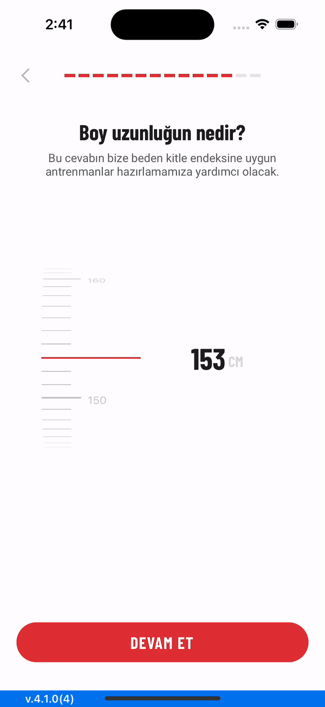
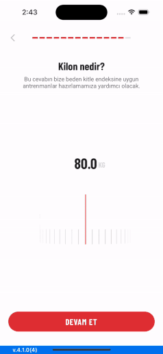

[](https://swift.org/package-manager/)

UI Component to display items in UIPickerView based on range selection.
# RangePicker
Enhance the user experience by using a RangePicker.

## Gifs
<div align="center">
  <span width="248" height="517">
    
    </span>
    <span width="248" height="517">
    
    </span>
</div>

## Requirements
* iOS 11.0+
* Xcode 14+
* Swift 5.8+

## Installation
RangePickerView is distributed via [Swift Package Manager](https://swift.org/package-manager/) which is the only official distribution tool by Apple. You can add RangePickerView to your project from Xcode's `File > Swift Packages > Add Package Dependency` menu with its github URL:
```
https://github.com/mobven/RangePicker.git
```

## Usage
### UIStoryboard
```swift
import RangePicker
@IBOutlet var rangePickerView: RangePickerView!
```

### Programmatically
```swift
let rangePickerView = RangePickerView()
rangePickerView.delegate = self
rangePickerView.range = (minimum: 100, maximum: 200)
self.view.addSubviews(rangePickerView)
```

#### Customization
You can easily customize the `RangePicker` with editing `Configuration` properties.

| Property                   | Type                        | Description                                                           |
| -------------------------- | --------------------------- | ----------------------------------------------------------------------|
| `alignment`                | `RangePickerView.Alignment` | The value for vertical or horizontal.                                 |
| `range`                    | `Int`                       | The minimum and maximum value for selection.                          |
| `valueType`                | `String`                    | The type of value to select. (Kg, cm etc.)                            |
| `visibilityRange`          | `Int`                       | The range of elements to display.                                     |
| `selectedIndex`            | `Int`                       | A zero-indexed number identifying selection of the range picker view. |
| `selectRow`                | `Int`                       | Select row of the picker view.                                        |
| `seperatorBackgroundColor` | `UIColor`                   | The background color of the separator view.                           |
| `lblValueTextFont`         | `UIFont`                    | The font for the lblValue's text.                                     |
| `lblValueTextColor`        | `UIColor`                   | The text color for the lblValue's text.                               |
| `lblValueTypeTextFont`     | `UIFont`                    | The font for the lblValueType's text.                                 |
| `lblValueTypeTextColor`    | `UIColor`                   | The text color for the lblValueType's text.                           |

##### Example 
You can customize properties like this,

```swift
  rangePickerView.alignment = .horizontal
  rangePickerView.valueType = "kg"
``` 
                                   
## What's next
- [] SwiftUI representable code example.
- [] Unit Tests.

---
Developed with 🖤 at [Mobven](https://mobven.com/)
