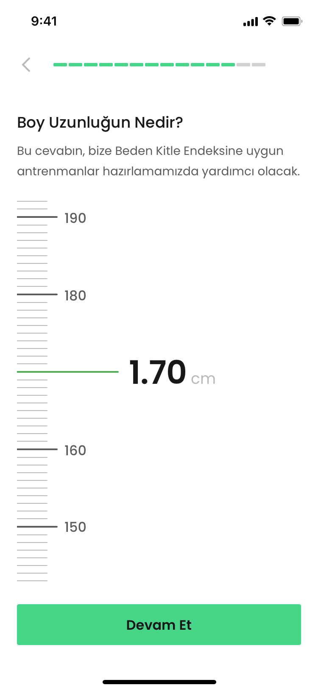
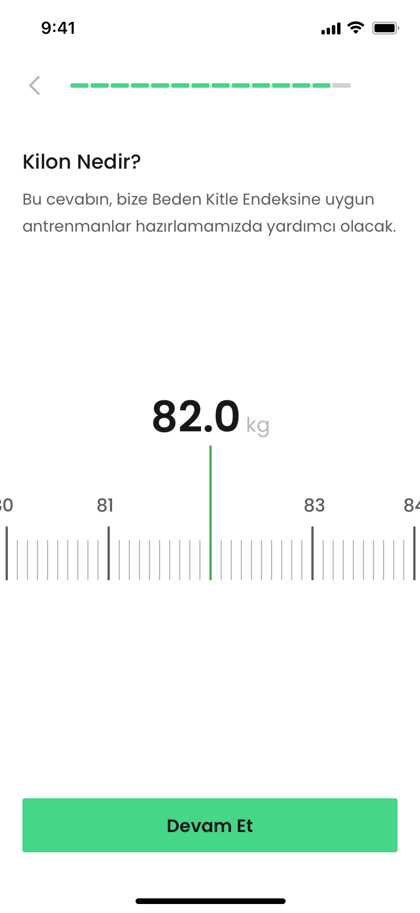

[](https://www.apache.org/licenses/LICENSE-2.0.html)
[](https://swift.org/package-manager/)

UI Component to display items in UIPickerView based on range selection.
# RangePicker

Enhance the user experience by using a RangePicker.

## Examples
<p align="center">
    
    
</p>

## Requirements
* iOS 11.0+
* Xcode 13+
* Swift 5.6+

## Installation
RangePickerView is distributed with [Swift Package Manager](https://swift.org/package-manager/) which is the only official distribution tool by Apple. You can add RangePickerView to your project from Xcode's `File > Swift Packages > Add Package Dependency` menu with its github URL:
```
https://github.com/mobven/RangePicker.git
```

## Usage
### UIStoryboard
```
import RangePickerView
@IBOutlet var rangePicker: RangePickerView!
```

### Programmatically
```swift
let rangePickerView = RangePickerView()
rangePickerView.delegate = self
rangePickerView.range = (minimum: 100, maximum: 200)
self.view.addSubviews(rangePickerView)
```

#### Customization
You can easly customize the tooltip with editing `Configuration` properties.


| Property                 | Type           | Description                                                                        |
| ------------------------ | -------------- | -----------------------------------------------------------------------------------|
| `horizontalPicker`       | `Bool`         | The value for vertical or horizontal.                                                |
| `range`                 | `Int`         | The minimum and maximum value for selection.                                                    |
| `valueType`              | `String`       | The type of value to select. (Kg, cm etc.)   

##### Example 
You can customize properties like this,

```swift
  rangePicker.horizontalPicker = true
  rangePicker.valueType = "kg"
``` 
                                   
## What's next
- [] SwiftUI representable code example.

---
Developed with 🖤 at [Mobven](https://mobven.com/)
